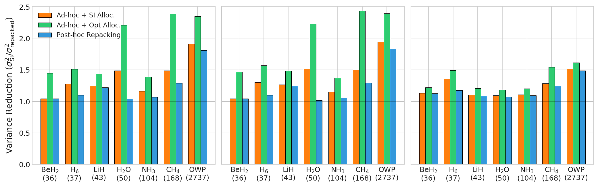
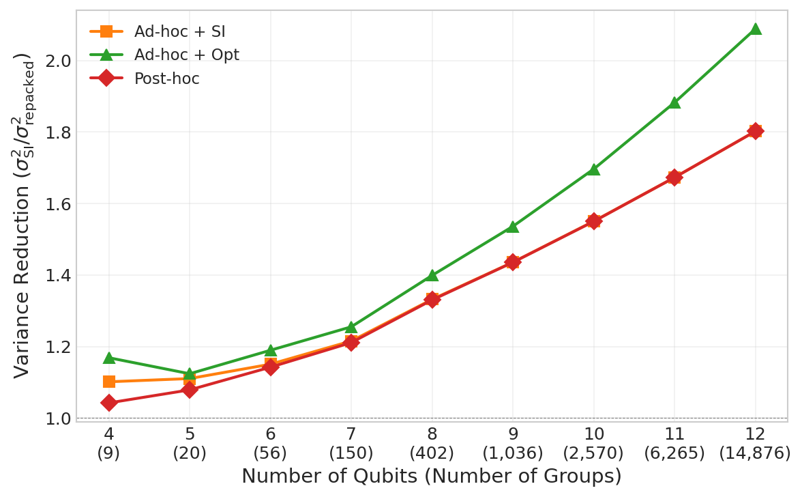
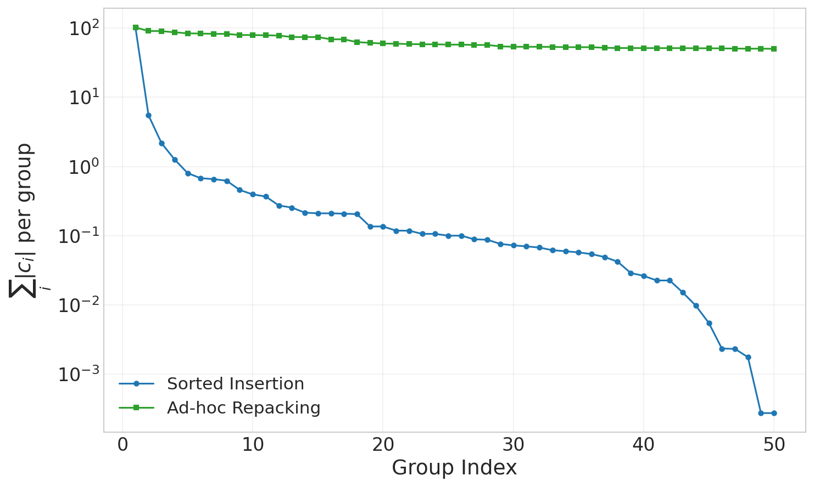
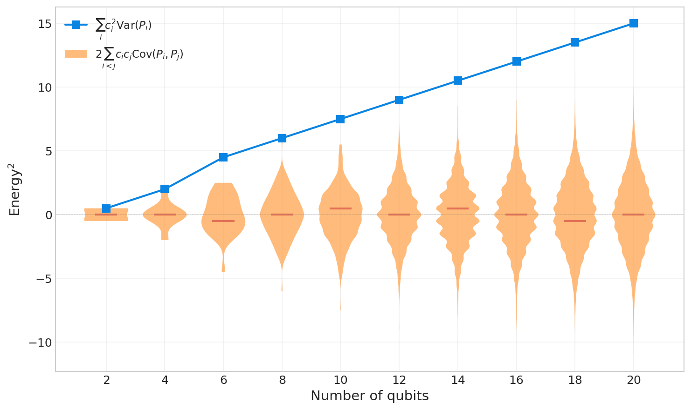
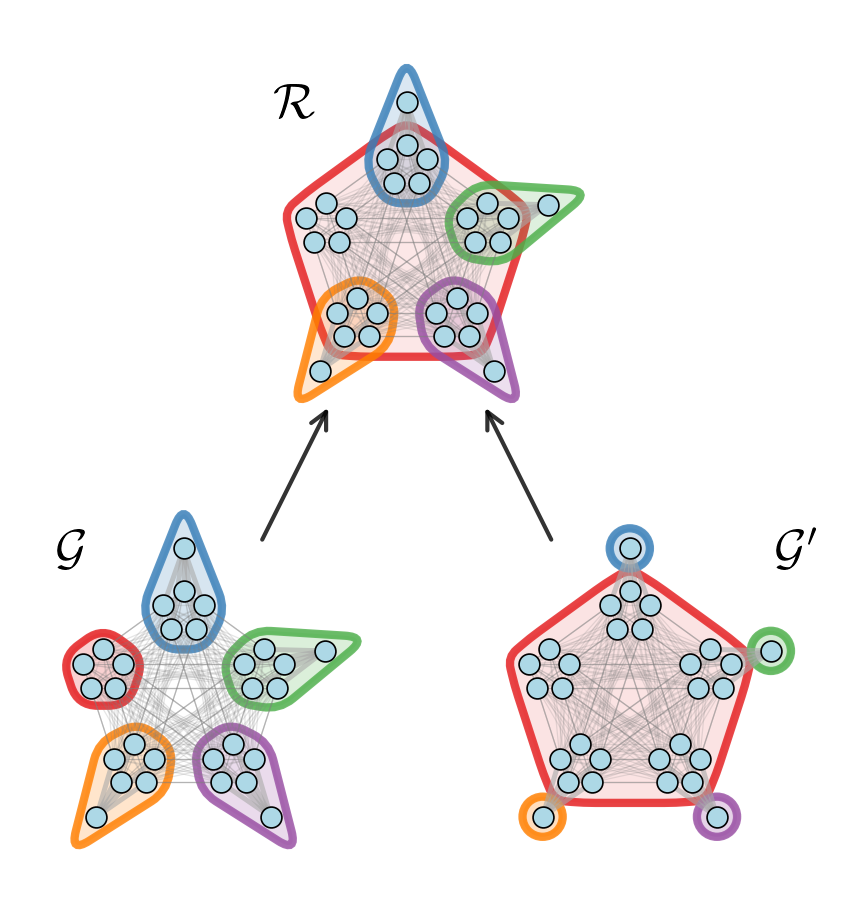

# OverlappedGroupingNumerics

Numerical results for "Overlapped groupings for quantum energy estimation."

## Figures











## Structure

- `ogn/` — Core library. Pauli operators use a symplectic bitwise representation for fast commutation checks via numba. Grouping (sorted insertion, ad-hoc repacking, post-hoc repacking), diagonalization, and covariance estimation are all numba-accelerated.
- `plots/` — One script per figure. All plots regenerate from pre-computed data in `data/`.
- `compute/` — Scripts to regenerate `data/` from scratch. Tensor network operations (DMRG, MPS expectation values) use quimb and kcommute. Molecular Hamiltonians are loaded from openfermion.
- `data/` — Pre-computed results and OWP system data.

## Reproducing plots

```bash
cd plots
python plot_coefficient_distribution.py
python plot_combined_allocation.py
python plot_hubbard_violin.py
python plot_partial_order.py
python plot_random_ham_scaling.py
```

## Recomputing results

Scripts in `compute/` regenerate `data/` from scratch. Small molecule results take minutes. The random Hamiltonian scaling study takes hours for the largest systems. OWP (44 qubits, 575k terms) requires several thousand core hours; parallelizing over groups is recommended.
