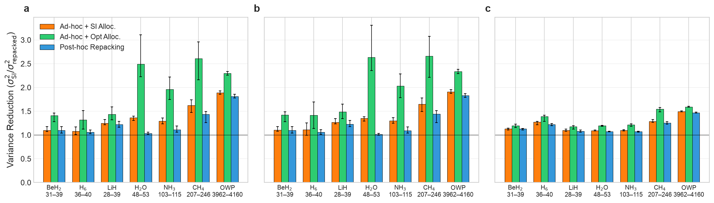
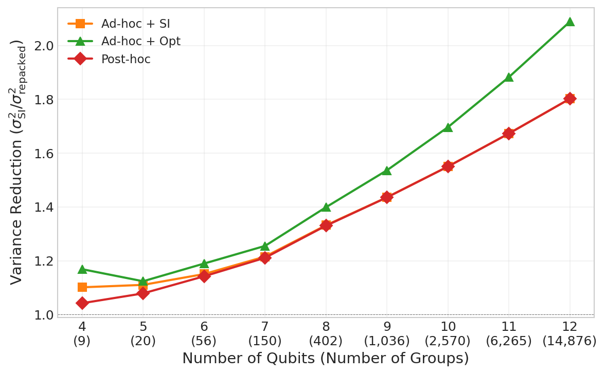
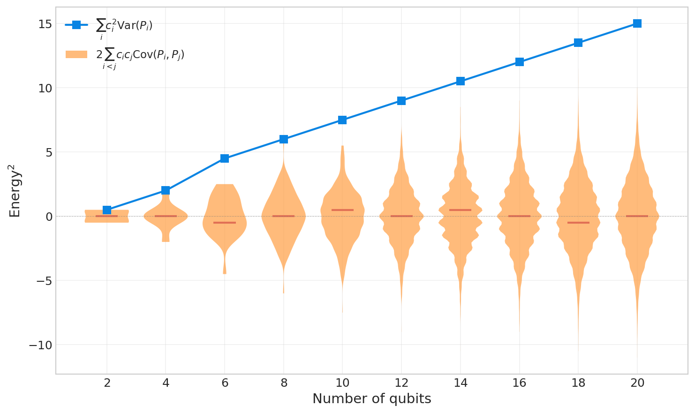
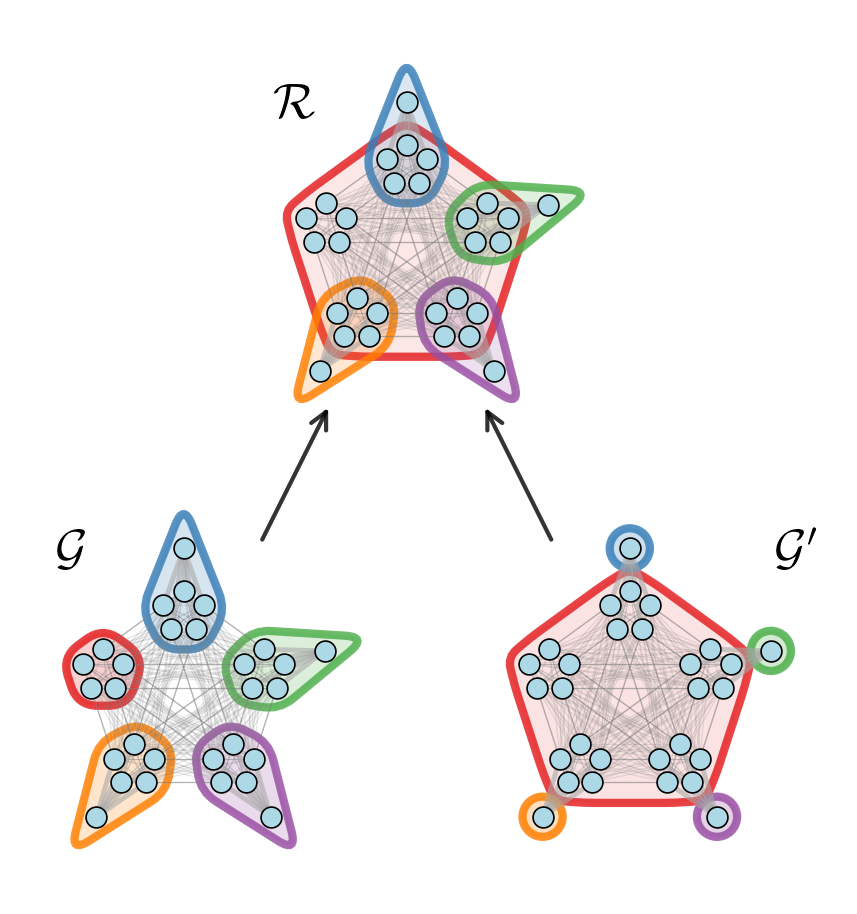

# OverlappedGroupingNumerics

Numerical results for "Overlapped groupings for quantum energy estimation."

## Figures









## Structure

- `ogn/` — Core library. Pauli operators use a symplectic bitwise representation for fast commutation checks via numba. Grouping (sorted insertion, ad-hoc repacking, post-hoc repacking) and post-hoc diagonalization are numba accelerated for all systems, and variance and covariance estimation is numba accelerated for product states.
- `plots/` — One script per figure. All plots regenerate from pre-computed data in `data/`.
- `compute/` — Scripts to regenerate `data/` from scratch. Tensor network operations (DMRG, MPS expectation values) use quimb. Molecular Hamiltonians (sto-3g, Jordan-Wigner) are generated by `compute/generate_molecules.py` from NIST CCCBDB experimental geometries (H6: linear chain, 1.0 Å spacing); `data/molecules/manifest.json` records each geometry, source, and file hash. `data/molecules/arxiv_v1_geometries.json` records the geometries behind the arXiv v1 molecular results.
- `data/` — Pre-computed results and OWP system data.

## Reproducing plots

```bash
cd plots
python plot_combined_allocation_ties.py
python plot_hubbard_violin.py
python plot_partial_order.py
python plot_random_ham_scaling.py
```

## Recomputing results

Scripts in `compute/` regenerate `data/` from scratch. Small molecule results take minutes. The Fermi-Hubbard variance/covariance data (`compute/compute_hubbard_varcov.py`) takes seconds. The random Hamiltonian scaling study takes hours for the largest systems. OWP (44 qubits, 575k terms) requires several thousand core hours; parallelizing over groups is recommended. The OWP job orchestration (SLURM batching, aggregation of per-group results) is cluster-specific and not included; `compute/compute_owp_group_varcov.py` is the per-group worker for the arXiv v1 OWP results in `data/results_optimal/`.

## Tie-order sampling

Sorted insertion is defined only up to the order of terms with equal |c| (|c| rounded to 10 decimals), which molecular Hamiltonians have in abundance (spin and XX/YY pairing, spatial symmetry). Each tie sample draws one random order within tie classes (seed `[seed, k]`) and applies it to the whole pipeline; every ratio is taken within its own sample. `plots/plot_combined_allocation_ties.py` plots the median and min–max over 10 samples from `data/results_optimal_cccbdb/*_tiesamples.json`; `data/results_optimal/` holds the arXiv v1 results (default term order, v1 geometries), plotted by `plots/plot_combined_allocation.py`.

- Molecules: `python compute/generate_molecules.py`, then `python compute/run_optimal_allocation.py <molecule> <dmrg|hf|random> all --tie-samples 10 [--workers N]`.
- OWP (`data/owp/dmrg_expectations.npz` holds the Hamiltonian and single-term DMRG expectation values): `compute/owp_tie_groupings.py` builds each sample's groupings and enumerates the product Paulis needed for the DMRG covariances; `compute/owp_union.py` merges them into one key list; `compute/owp_exp_worker.py` evaluates them on the χ=64 MPS (`compute/pauli_sweep.py`), split across cluster jobs (`compute/owp_block_worker.py` evaluates an explicit list of remaining blocks); `compute/owp_assemble.py` collects the values; `compute/owp_dmrg_variances.py` and `compute/owp_tie_product.py` give the DMRG and product-state variances; `compute/owp_collect.py` writes `OWP_<state>_tiesamples.json`. Cluster job orchestration is not included; `data/results_optimal_cccbdb/OWP_campaign_provenance.json` records how the OWP values were computed.
